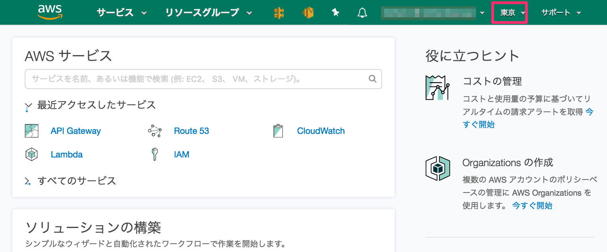

# aws-navbar-color-by-region



AWS マネージメントコンソールのナビゲーションバーをリージョン別で色分けする Stylish のスタイル。


## インストール

[userstyles.org](https://userstyles.org/styles/150583/aws-navbar-color-by-region)


## 作り方

このリポジトリのソースコードの代わり。dist.css を生成する。

1. [AWS リージョン一覧](http://docs.aws.amazon.com/ja_jp/AWSEC2/latest/UserGuide/using-regions-availability-zones.html) を取得する
2. リージョン名を md5 で数値に変換
3. リージョン名を表す数値を 360 の剰余を計算し、これを色相とする
4. 各リージョン (ドメイン名で判定) 用の CSS を作成: リージョン名を表す色相を CSS hsl に適用する

```console
$ aws ec2 describe-regions --all-regions --query 'Regions[*].[RegionName]' --output text | sort | xargs -I{} sh -c 'printf "%s\t" "{}"; echo "obase=10;ibase=16;$(echo "{}" | md5 | tr "[a-f]" "[A-F"]) % 168" | bc' | awk '{print "@-moz-document domain(" $1 ".console.aws.amazon.com) { [data-testid=\"awsc-nav-header-viewport-shelf-inner\"] { background-color: hsl(" $2 ", 50%, 30%); } }" }' > dist.css
```
